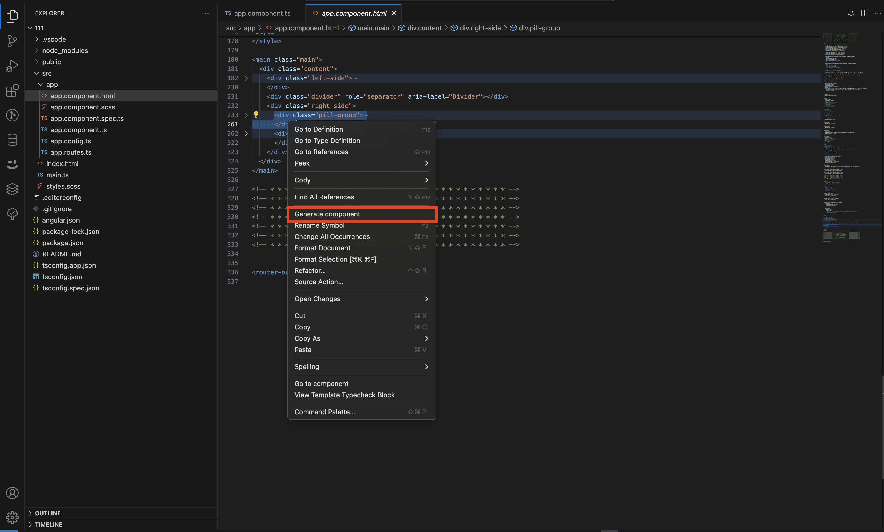
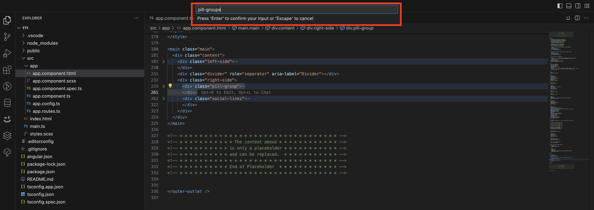
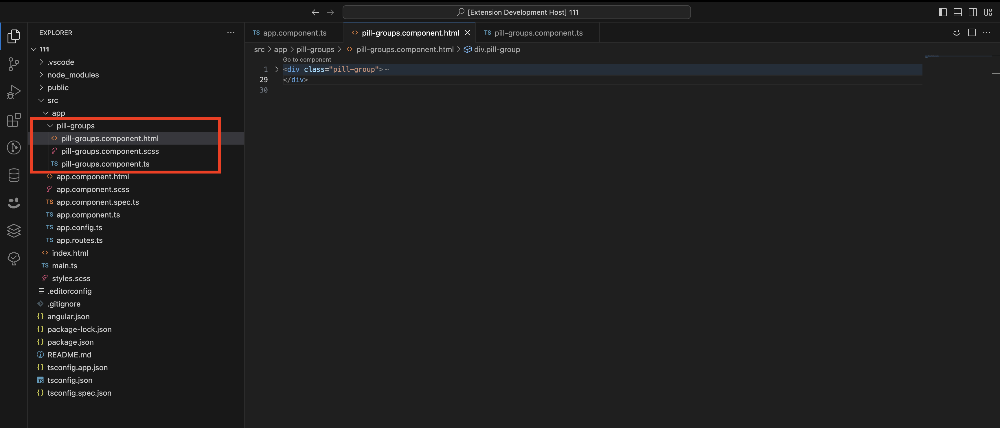

# ng-g-comp README

Creates Angular component from existing html peace of code by copy pasting additionally current component styles and logic. Currently supports only scss styles.

## Features

To create component you need to

- select the html code and choose generate component in context menu

- write new component name with dashes

- new component should appear in current folder as subfolder

